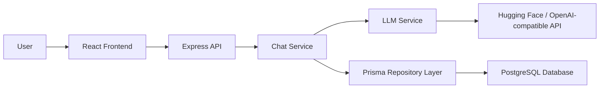

# AI Support Agent Project Documentation

## 1. Project Overview

This project is a lightweight AI-powered support assistant built as a full-stack web application. It allows users to chat with an AI support agent that can answer questions related to orders, delivery, returns, refunds, billing, and product guidance. The system also stores conversations in a database so users can revisit previous sessions and continue discussions later.

The application is designed as a practical demo of:
- A modern React frontend
- An Express + TypeScript backend
- Prisma ORM with PostgreSQL
- LLM integration through the OpenAI-compatible Hugging Face router
- Session-based chat persistence

---

## 2. Business Goal

The project aims to simulate a real-world customer support experience where:
- a customer can ask questions in natural language,
- the AI assistant responds with a polished and helpful answer,
- conversations are saved so context is retained across sessions,
- the experience feels like a lightweight support portal or embedded help widget.

This is ideal for demonstrating how AI support agents can be integrated into web products without requiring a full enterprise support suite.

---

## 3. Core Features

### Functional Features
- Chat interface for customer support conversations
- Session-based conversation handling
- Persistent conversation history in a database
- Recent conversation panel for switching between sessions
- AI-generated responses with a fallback human-like message if the model fails
- Basic user identity persistence using localStorage
- Restart and reset actions for the chat experience

### Non-Functional Features
- Simple and modular architecture
- Type-safe backend and frontend via TypeScript
- Separation of concerns between routes, services, repositories, and validators
- Minimal production-ready structure for a demo or prototype

---

## 4. Tech Stack

| Layer | Technology |
|---|---|
| Frontend | React, TypeScript, Vite |
| Backend | Express, TypeScript |
| Validation | Zod |
| Database | PostgreSQL + Prisma ORM |
| AI Integration | OpenAI SDK with Hugging Face router |
| Environment Handling | dotenv |
| API Communication | REST APIs with JSON |

---

## 5. System Architecture

### High-level Architecture



### Architectural Principles
- Frontend is responsible for UI and local interaction state.
- Backend handles request validation, conversation management, and AI orchestration.
- Repository layer abstracts database operations.
- Service layer contains the business logic for handling chat workflows.
- Prisma models define persistent data structures.

---

## 6. Folder Structure Summary

### Frontend
- frontend/src/components
  - ChatWindow.tsx: main chat container
  - ChatInput.tsx: message input UI
  - MessageBubble.tsx: message rendering
  - SessionHistory.tsx: session list panel
  - WelcomeCard.tsx: initial onboarding UI
- frontend/src/hooks
  - useChat.ts: chat state and message sending logic
- frontend/src/services
  - chatApi.ts: REST client for backend communication

### Backend
- backend/src/routes
  - chat.routes.ts: routes for sending messages, retrieving history, listing sessions
- backend/src/repositories
  - conversation.repo.ts: conversation CRUD logic
  - message.repo.ts: message CRUD logic
  - services/chat.service.ts: orchestrates conversation + reply generation
  - services/llm.service.ts: LLM API integration
- backend/src/validators
  - chat.validator.ts: request validation using Zod
- backend/src/config
  - env.ts: environment variable management
  - prisma.ts: Prisma client setup

### Database
- backend/prisma/schema.prisma: schema for Conversation and Message models

---

## 7. End-to-End Request Flow

### 1. User sends a message
The user types a message into the chat input component.

### 2. Frontend sends request
The React hook useChat sends the message to the backend endpoint /chat/message.

### 3. Backend validates input
The request goes through Zod validation to ensure the payload is valid.

### 4. Conversation is resolved or created
The chat service checks whether the provided sessionId exists.
- If no session exists, a new conversation is created.
- If a valid session exists, the existing conversation is reused.

### 5. User message is stored
The message is saved into the Message table with sender = user.

### 6. AI reply is generated
The backend fetches the relevant conversation history and sends it to the LLM service.

### 7. AI response is saved
The assistant reply is stored as a new message with sender = ai.

### 8. Response is returned to UI
The frontend receives the reply and displays it in the chat window.

### 9. Session history is available
The user can view past conversations from the Recent panel and reopen them.

---

## 8. Core Backend Flow in Detail

### API Routes
- POST /chat/message
  - Accepts a message and optional sessionId
  - Creates/uses a conversation
  - Stores user prompt
  - Calls LLM for reply
  - Saves assistant response

- GET /chat/history?sessionId=...
  - Returns all messages for a selected conversation

- GET /chat/sessions
  - Returns recent conversations with preview text and update time

### Service Responsibilities
- Chat Service
  - Coordinates the chat workflow
  - Handles conversation creation and reuse
  - Persists messages
  - Fallbacks to a safe message when AI fails

- LLM Service
  - Builds the prompt
  - Sends the request to the model provider
  - Returns the generated assistant reply

### Repository Layer
- conversation.repo.ts handles conversation lifecycle
- message.repo.ts handles message insertion and retrieval

---

## 9. Data Model

### Conversation
Represents a single support chat session.

Fields:
- id: unique identifier
- createdAt: timestamp

### Message
Represents one message in a conversation.

Fields:
- id: unique identifier
- conversationId: links to a conversation
- sender: user or ai
- text: the content of the message
- createdAt: timestamp

This schema is intentionally simple and suitable for a prototype or MVP.

---

## 10. Frontend Flow in Detail

### App Behavior
- The application opens as a support popup widget.
- If the user has not provided a name yet, they see a welcome card.
- Once the name is set, the main chat interface loads.

### State Management
- The application uses React state and hooks instead of a global state library.
- The chat hook manages:
  - message list
  - loading state
  - message sending behavior
  - optimistic UI updates

### Session Persistence
- sessionId and userName are stored in localStorage.
- On reload, the app can restore the previous conversation context.

---

## 11. Error Handling and Resilience

The current implementation already includes some basic resilience patterns:
- If LLM generation fails, the app returns a graceful fallback support message.
- The frontend shows a temporary typing indicator while waiting for the backend.
- The UI catches failed requests and displays an error message to the user.

Possible future improvements:
- Retry logic for transient LLM failures
- Timeout and circuit breaker patterns
- Better logging and monitoring
- Rate limiting and authentication
- Queue-based processing for high traffic

---

## 12. Setup and Run Instructions

### Prerequisites
- Node.js and npm
- PostgreSQL database
- Environment variables for the backend

### Required Environment Variables
- PORT
- HF_API_KEY
- DATABASE_URL

### Backend
```bash
cd backend
npm install
npm run dev
```

### Frontend
```bash
cd frontend
npm install
npm run dev
```

### Database Setup
Use Prisma migrations to initialize the database schema.

```bash
cd backend
npx prisma migrate dev
```

---

## 13. Interview Questions

### A. Backend Questions

1. How would you improve the current API design?
   - Discuss validation, error response structure, request id propagation, and consistent status codes.

2. What happens if the database is unavailable?
   - A strong answer should mention graceful degradation, error handling, retries, logging, and possibly a fallback response.

3. How would you secure this API in production?
   - Talk about authentication, rate limiting, input sanitization, CORS configuration, environment secrets, and request logging.

4. Why is the repository layer useful here?
   - It keeps data access logic separate from business rules and makes testing easier.

5. How would you test this backend?
   - Mention unit tests for services, integration tests for routes, and mock-based tests for LLM behavior.

### B. System Design Questions

1. How would you scale this from a demo app to a production support system?
   - Discuss stateless backend services, horizontal scaling, database sharding or partitioning, caching, queueing, and observability.

2. How would you design a chat system for thousands of concurrent users?
   - Talk about load balancers, async processing, message queues, WebSocket support, and persistent storage.

3. What would you change if the AI service became the bottleneck?
   - Mention caching, prompt optimization, model selection, asynchronous responses, and fallback routing.

4. How would you design a conversation history system?
   - Mention conversation IDs, pagination, indexing, retention policies, and archival strategies.

5. What monitoring would you add?
   - Metrics like latency, request success rate, model response time, token usage, error rates, and database health.

### C. AI / LLM Questions

1. How does this application use the LLM?
   - Explain prompt construction, chat history context, and response generation.

2. What are the risks of using LLMs for customer support?
   - Hallucinations, incorrect policy statements, safety issues, and inconsistency.

3. How would you reduce hallucinations?
   - Add grounding data, use retrieval-augmented generation, validate against a knowledge base, and enforce strict prompt instructions.

4. What is the role of the system prompt here?
   - It defines behavior, tone, boundaries, and response style.

5. How would you evaluate the quality of replies?
   - Mention human review, task success rate, policy compliance, latency, and customer satisfaction metrics.

### D. Scenario-Based Questions

1. Scenario: The LLM is slow or returns an error.
   - How would you handle this in the product?
   - Good answer: show a friendly fallback message, log the issue, retry once, and preserve the conversation state.

2. Scenario: A user asks for a refund and the AI is uncertain about policy.
   - How should the assistant respond?
   - Good answer: avoid inventing policy; acknowledge uncertainty; ask a follow-up or direct the user to a human agent.

3. Scenario: The same user opens the app on two devices.
   - How would you maintain conversation consistency?
   - Good answer: use a stable sessionId and sync state from the backend; handle merge or conflict logic carefully.

4. Scenario: A large number of users start chatting at the same time.
   - How would you avoid system overload?
   - Good answer: use rate limiting, async background processing, caching, and autoscaling.

5. Scenario: The database becomes unavailable during chat.
   - How should the system behave?
   - Good answer: preserve the user experience as much as possible, surface an error clearly, and avoid data loss through retries and logging.

---

## 14. Strengths of the Current Project

- Clear separation of frontend and backend responsibilities
- Simple conversation persistence
- Easy to understand for interview or portfolio presentation
- Good foundation for extending into a real AI support product

## 15. Areas for Improvement

- Add authentication and authorization
- Add rate limiting and abuse protection
- Improve observability and logging
- Introduce a knowledge base for grounded responses
- Add real-time streaming responses
- Improve test coverage and deployment automation

---

## 16. Final Summary

This project is a compact, well-structured AI support assistant that demonstrates how a modern web app can connect users to an LLM-backed assistant while preserving conversation context. It is strong as a demo project, interview portfolio piece, and starting point for a much more advanced customer support platform.
